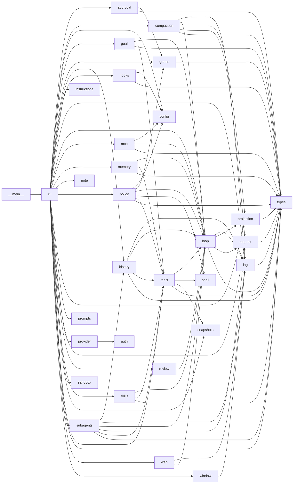

<!-- Generated by `python -m cade.mini.docs catalogs --write`. Do not edit by hand. -->

# Module graph

Relative imports inside `src/cade/mini/`.

```mermaid
flowchart LR
  __main__ --> cli
  approval --> grants
  approval --> types
  cli --> approval
  cli --> compaction
  cli --> config
  cli --> goal
  cli --> grants
  cli --> history
  cli --> hooks
  cli --> instructions
  cli --> log
  cli --> loop
  cli --> mcp
  cli --> memory
  cli --> note
  cli --> policy
  cli --> projection
  cli --> prompts
  cli --> provider
  cli --> request
  cli --> review
  cli --> sandbox
  cli --> skills
  cli --> snapshots
  cli --> subagents
  cli --> tools
  cli --> types
  cli --> web
  cli --> window
  compaction --> log
  compaction --> loop
  compaction --> projection
  compaction --> request
  compaction --> types
  goal --> loop
  goal --> tools
  goal --> types
  grants --> types
  history --> log
  history --> loop
  history --> tools
  history --> types
  hooks --> config
  hooks --> types
  log --> types
  loop --> log
  loop --> projection
  loop --> request
  loop --> types
  mcp --> config
  mcp --> loop
  mcp --> types
  memory --> loop
  memory --> tools
  memory --> types
  policy --> config
  policy --> grants
  policy --> loop
  policy --> shell
  policy --> tools
  policy --> types
  projection --> types
  provider --> auth
  request --> types
  review --> loop
  skills --> loop
  skills --> tools
  skills --> types
  subagents --> history
  subagents --> log
  subagents --> loop
  subagents --> request
  subagents --> tools
  subagents --> types
  tools --> loop
  tools --> shell
  tools --> snapshots
  tools --> types
  web --> log
  web --> loop
  window --> log
```
