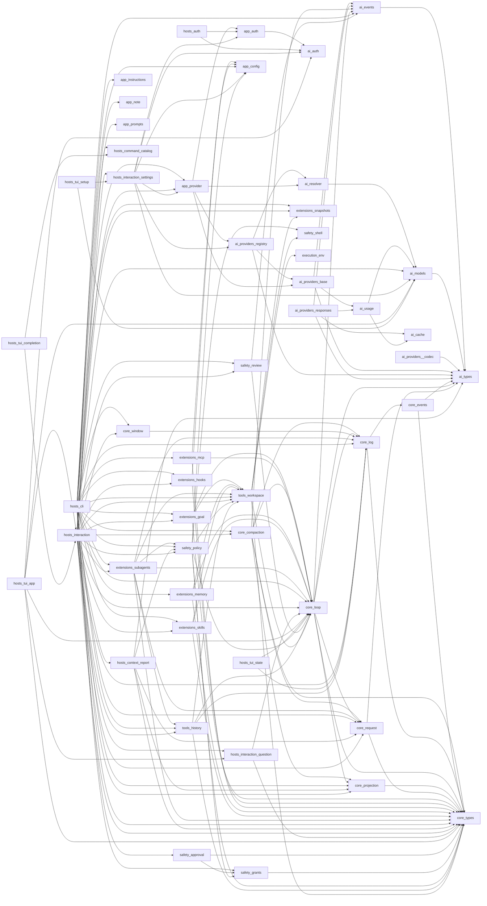

<!-- Generated by `python -m cade_mini.docs catalogs --write`. Do not edit by hand. -->

# Module graph

Absolute imports inside `src/cade_mini/`.

```mermaid
flowchart LR
  ai_events --> ai_types
  ai_models --> ai_types
  ai_providers__codec --> ai_types
  ai_providers_base --> ai_events
  ai_providers_base --> ai_types
  ai_providers_base --> ai_usage
  ai_providers_registry --> ai_providers_base
  ai_providers_registry --> ai_resolver
  ai_providers_registry --> ai_types
  ai_providers_responses --> ai_cache
  ai_providers_responses --> ai_events
  ai_providers_responses --> ai_types
  ai_providers_responses --> ai_usage
  ai_resolver --> ai_models
  ai_usage --> ai_cache
  ai_usage --> ai_models
  app_auth --> ai_auth
  app_provider --> ai_providers_base
  app_provider --> ai_providers_registry
  app_provider --> ai_resolver
  app_provider --> app_auth
  core_compaction --> ai_events
  core_compaction --> core_log
  core_compaction --> core_loop
  core_compaction --> core_projection
  core_compaction --> core_request
  core_compaction --> core_types
  core_events --> ai_types
  core_events --> core_types
  core_log --> core_events
  core_log --> core_types
  core_loop --> ai_events
  core_loop --> ai_types
  core_loop --> core_log
  core_loop --> core_projection
  core_loop --> core_request
  core_loop --> core_types
  core_projection --> core_types
  core_request --> ai_types
  core_request --> core_types
  core_window --> core_log
  extensions_goal --> core_loop
  extensions_goal --> core_types
  extensions_goal --> tools_workspace
  extensions_hooks --> app_config
  extensions_hooks --> core_types
  extensions_mcp --> app_config
  extensions_mcp --> core_loop
  extensions_mcp --> core_types
  extensions_memory --> core_loop
  extensions_memory --> core_types
  extensions_memory --> tools_workspace
  extensions_skills --> core_loop
  extensions_skills --> core_types
  extensions_skills --> tools_workspace
  extensions_subagents --> core_log
  extensions_subagents --> core_loop
  extensions_subagents --> core_request
  extensions_subagents --> core_types
  extensions_subagents --> safety_policy
  extensions_subagents --> tools_history
  extensions_subagents --> tools_workspace
  hosts_auth --> ai_auth
  hosts_auth --> app_auth
  hosts_cli --> app_config
  hosts_cli --> app_instructions
  hosts_cli --> app_note
  hosts_cli --> app_prompts
  hosts_cli --> app_provider
  hosts_cli --> core_compaction
  hosts_cli --> core_log
  hosts_cli --> core_loop
  hosts_cli --> core_projection
  hosts_cli --> core_request
  hosts_cli --> core_types
  hosts_cli --> core_window
  hosts_cli --> extensions_goal
  hosts_cli --> extensions_hooks
  hosts_cli --> extensions_mcp
  hosts_cli --> extensions_memory
  hosts_cli --> extensions_skills
  hosts_cli --> extensions_snapshots
  hosts_cli --> extensions_subagents
  hosts_cli --> safety_approval
  hosts_cli --> safety_grants
  hosts_cli --> safety_policy
  hosts_cli --> safety_review
  hosts_cli --> tools_history
  hosts_cli --> tools_workspace
  hosts_context_report --> ai_types
  hosts_context_report --> core_projection
  hosts_context_report --> core_request
  hosts_context_report --> core_types
  hosts_context_report --> safety_policy
  hosts_interaction --> ai_events
  hosts_interaction --> ai_models
  hosts_interaction --> app_provider
  hosts_interaction --> core_compaction
  hosts_interaction --> core_log
  hosts_interaction --> core_loop
  hosts_interaction --> core_projection
  hosts_interaction --> core_request
  hosts_interaction --> core_types
  hosts_interaction --> core_window
  hosts_interaction --> extensions_goal
  hosts_interaction --> extensions_hooks
  hosts_interaction --> extensions_skills
  hosts_interaction --> extensions_snapshots
  hosts_interaction --> extensions_subagents
  hosts_interaction --> hosts_command_catalog
  hosts_interaction --> hosts_context_report
  hosts_interaction --> hosts_interaction_question
  hosts_interaction --> hosts_interaction_settings
  hosts_interaction --> safety_policy
  hosts_interaction --> safety_review
  hosts_interaction --> tools_history
  hosts_interaction --> tools_workspace
  hosts_interaction_question --> core_loop
  hosts_interaction_question --> core_types
  hosts_interaction_settings --> ai_auth
  hosts_interaction_settings --> ai_models
  hosts_interaction_settings --> ai_providers_registry
  hosts_interaction_settings --> app_auth
  hosts_interaction_settings --> app_config
  hosts_interaction_settings --> app_provider
  hosts_tui_app --> ai_auth
  hosts_tui_app --> ai_models
  hosts_tui_app --> core_loop
  hosts_tui_app --> core_types
  hosts_tui_app --> hosts_interaction
  hosts_tui_app --> hosts_interaction_question
  hosts_tui_completion --> hosts_command_catalog
  hosts_tui_completion --> hosts_interaction
  hosts_tui_setup --> ai_models
  hosts_tui_setup --> hosts_interaction_settings
  hosts_tui_state --> core_log
  hosts_tui_state --> core_loop
  safety_approval --> core_types
  safety_approval --> safety_grants
  safety_grants --> core_types
  safety_policy --> app_config
  safety_policy --> core_loop
  safety_policy --> core_types
  safety_policy --> safety_grants
  safety_policy --> safety_shell
  safety_policy --> tools_workspace
  safety_review --> ai_events
  safety_review --> core_loop
  tools_history --> core_log
  tools_history --> core_loop
  tools_history --> core_types
  tools_history --> tools_workspace
  tools_workspace --> core_loop
  tools_workspace --> core_types
  tools_workspace --> execution_env
  tools_workspace --> extensions_snapshots
  tools_workspace --> safety_shell
```
