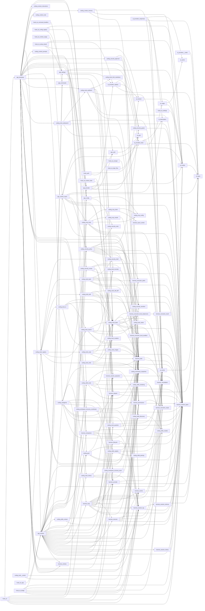

<!-- Generated by `uv run --locked python -m cade.docs catalogs --write`. Do not edit by hand. -->

# Module graph

Absolute imports inside `src/cade/`.

```mermaid
flowchart LR
  ai_events --> ai_types
  ai_models --> ai_types
  ai_providers__codec --> ai_types
  ai_providers_base --> ai_events
  ai_providers_base --> ai_tokenization
  ai_providers_base --> ai_types
  ai_providers_base --> ai_usage
  ai_providers_registry --> ai_providers_base
  ai_providers_registry --> ai_resolver
  ai_providers_registry --> ai_types
  ai_providers_responses --> ai_cache
  ai_providers_responses --> ai_events
  ai_providers_responses --> ai_tokenization
  ai_providers_responses --> ai_types
  ai_providers_responses --> ai_usage
  ai_resolver --> ai_models
  ai_usage --> ai_cache
  ai_usage --> ai_models
  app_auth --> ai_auth
  app_bootstrap --> app_config
  app_bootstrap --> app_provider
  app_bootstrap --> app_session
  app_bootstrap --> coding_context_instructions
  app_bootstrap --> coding_context_memory
  app_bootstrap --> coding_context_note
  app_bootstrap --> coding_context_prompts
  app_bootstrap --> coding_goal
  app_bootstrap --> coding_mcp_tools
  app_bootstrap --> coding_security_approval
  app_bootstrap --> coding_security_grants
  app_bootstrap --> coding_security_policy
  app_bootstrap --> coding_security_review
  app_bootstrap --> coding_skills_tools
  app_bootstrap --> coding_subagents
  app_bootstrap --> coding_tools_question
  app_bootstrap --> coding_tools_registry
  app_bootstrap --> coding_tools_webfetch
  app_bootstrap --> coding_tools_websearch
  app_bootstrap --> coding_workspace_recovery_coordinator
  app_bootstrap --> coding_workspace_snapshots
  app_bootstrap --> harness_compaction
  app_bootstrap --> harness_execution_local_sandbox
  app_bootstrap --> harness_permissions
  app_bootstrap --> harness_provider
  app_bootstrap --> harness_request
  app_bootstrap --> harness_session_log
  app_bootstrap --> harness_tools
  app_bootstrap --> harness_window
  app_config --> coding_mcp_config
  app_config --> coding_security_rules
  app_context_report --> ai_models
  app_context_report --> ai_providers_base
  app_context_report --> ai_tokenization
  app_context_report --> ai_types
  app_context_report --> coding_mcp_tools
  app_context_report --> coding_security_policy
  app_context_report --> harness_request
  app_context_report --> harness_session_projection
  app_context_report --> harness_session_types
  app_context_report --> harness_tools
  app_provider --> ai_models
  app_provider --> ai_providers_base
  app_provider --> ai_providers_registry
  app_provider --> ai_resolver
  app_provider --> app_auth
  app_session --> ai_events
  app_session --> ai_models
  app_session --> app_commands
  app_session --> app_context_report
  app_session --> app_provider
  app_session --> app_settings
  app_session --> coding_goal
  app_session --> coding_mcp_tools
  app_session --> coding_security_policy
  app_session --> coding_security_review
  app_session --> coding_skills_context
  app_session --> coding_skills_models
  app_session --> coding_skills_tools
  app_session --> coding_subagents
  app_session --> coding_tools_base
  app_session --> coding_tools_history
  app_session --> coding_tools_question
  app_session --> coding_workspace_recovery_coordinator
  app_session --> coding_workspace_recovery_store
  app_session --> coding_workspace_snapshots
  app_session --> harness_cancellation
  app_session --> harness_compaction
  app_session --> harness_events
  app_session --> harness_executor
  app_session --> harness_loop
  app_session --> harness_permissions
  app_session --> harness_provider
  app_session --> harness_request
  app_session --> harness_session_history
  app_session --> harness_session_log
  app_session --> harness_session_projection
  app_session --> harness_session_types
  app_session --> harness_tools
  app_session --> harness_window
  app_settings --> ai_auth
  app_settings --> ai_models
  app_settings --> ai_providers_registry
  app_settings --> app_auth
  app_settings --> app_config
  app_settings --> app_provider
  coding_context_memory --> coding_tools_base
  coding_context_memory --> harness_cancellation
  coding_context_memory --> harness_session_types
  coding_context_memory --> harness_tools
  coding_goal --> coding_tools_base
  coding_goal --> harness_cancellation
  coding_goal --> harness_session_types
  coding_goal --> harness_tools
  coding_mcp_client --> coding_mcp_config
  coding_mcp_client --> harness_async_worker
  coding_mcp_results --> harness_tools
  coding_mcp_tools --> coding_mcp_client
  coding_mcp_tools --> coding_mcp_results
  coding_mcp_tools --> coding_mcp_config
  coding_mcp_tools --> harness_cancellation
  coding_mcp_tools --> harness_session_types
  coding_mcp_tools --> harness_tools
  coding_security_approval --> coding_security_grants
  coding_security_approval --> coding_security_sensitive
  coding_security_approval --> harness_permissions
  coding_security_grants --> harness_session_types
  coding_security_policy --> coding_security_grants
  coding_security_policy --> coding_security_rules
  coding_security_policy --> coding_security_sensitive
  coding_security_policy --> coding_security_shell
  coding_security_policy --> harness_execution_paths
  coding_security_policy --> harness_execution_scope
  coding_security_policy --> harness_permissions
  coding_security_policy --> harness_session_types
  coding_security_policy --> harness_tools
  coding_security_review --> ai_events
  coding_security_review --> harness_permissions
  coding_security_review --> harness_provider
  coding_security_review --> harness_request
  coding_security_review --> harness_session_types
  coding_security_shell --> coding_security_sensitive
  coding_skills_context --> coding_skills_registry
  coding_skills_context --> coding_skills_tools
  coding_skills_context --> harness_session_types
  coding_skills_discovery --> coding_skills_models
  coding_skills_registry --> coding_skills_discovery
  coding_skills_registry --> coding_skills_models
  coding_skills_registry --> coding_skills_parsing
  coding_skills_rendering --> coding_skills_models
  coding_skills_tools --> coding_skills_discovery
  coding_skills_tools --> coding_skills_models
  coding_skills_tools --> coding_skills_registry
  coding_skills_tools --> coding_skills_rendering
  coding_skills_tools --> coding_tools_base
  coding_skills_tools --> harness_session_types
  coding_skills_tools --> harness_tools
  coding_subagents --> coding_security_policy
  coding_subagents --> coding_tools_history
  coding_subagents --> harness_cancellation
  coding_subagents --> harness_lifecycle
  coding_subagents --> harness_loop
  coding_subagents --> harness_permissions
  coding_subagents --> harness_provider
  coding_subagents --> harness_request
  coding_subagents --> harness_session_log
  coding_subagents --> harness_session_types
  coding_subagents --> harness_tools
  coding_tools__worker --> coding_tools_registry
  coding_tools__worker --> harness_execution_scope
  coding_tools__worker --> harness_tools
  coding_tools_base --> coding_tools_native
  coding_tools_base --> coding_workspace_snapshots
  coding_tools_base --> harness_cancellation
  coding_tools_base --> harness_execution_local_sandbox
  coding_tools_base --> harness_execution_local_subprocess
  coding_tools_base --> harness_execution_paths
  coding_tools_base --> harness_execution_scope
  coding_tools_base --> harness_session_types
  coding_tools_base --> harness_tools
  coding_tools_bash --> coding_security_shell
  coding_tools_bash --> coding_tools_base
  coding_tools_bash --> coding_workspace_snapshots
  coding_tools_bash --> harness_execution_local_subprocess
  coding_tools_bash --> harness_execution_paths
  coding_tools_bash --> harness_session_types
  coding_tools_bash --> harness_tools
  coding_tools_edit --> coding_tools_base
  coding_tools_edit --> coding_tools_edit_diff
  coding_tools_edit --> coding_tools_mutation
  coding_tools_edit --> coding_workspace_snapshots
  coding_tools_edit --> harness_session_types
  coding_tools_edit --> harness_tools
  coding_tools_history --> coding_tools_base
  coding_tools_history --> harness_session_log
  coding_tools_history --> harness_session_types
  coding_tools_history --> harness_tools
  coding_tools_images --> harness_tools
  coding_tools_ls --> coding_tools_base
  coding_tools_ls --> coding_tools_search
  coding_tools_ls --> harness_session_types
  coding_tools_ls --> harness_tools
  coding_tools_question --> harness_cancellation
  coding_tools_question --> harness_session_types
  coding_tools_question --> harness_tools
  coding_tools_read --> coding_tools_base
  coding_tools_read --> coding_tools_images
  coding_tools_read --> coding_tools_truncate
  coding_tools_read --> harness_session_types
  coding_tools_read --> harness_tools
  coding_tools_registry --> coding_tools_base
  coding_tools_registry --> coding_tools_bash
  coding_tools_registry --> coding_tools_edit
  coding_tools_registry --> coding_tools_ls
  coding_tools_registry --> coding_tools_read
  coding_tools_registry --> coding_tools_search
  coding_tools_registry --> coding_tools_write
  coding_tools_registry --> coding_workspace_snapshots
  coding_tools_registry --> harness_execution_local_sandbox
  coding_tools_search --> coding_tools_base
  coding_tools_search --> coding_tools_native
  coding_tools_search --> coding_tools_truncate
  coding_tools_search --> harness_execution_local_subprocess
  coding_tools_search --> harness_session_types
  coding_tools_search --> harness_tools
  coding_tools_webfetch --> coding_tools_base
  coding_tools_webfetch --> coding_tools_html_markdown
  coding_tools_webfetch --> coding_tools_truncate
  coding_tools_webfetch --> harness_cancellation
  coding_tools_webfetch --> harness_session_types
  coding_tools_webfetch --> harness_tools
  coding_tools_websearch --> coding_tools_webfetch
  coding_tools_websearch --> harness_cancellation
  coding_tools_websearch --> harness_session_types
  coding_tools_websearch --> harness_tools
  coding_tools_write --> coding_tools_base
  coding_tools_write --> coding_tools_mutation
  coding_tools_write --> coding_workspace_snapshots
  coding_tools_write --> harness_session_types
  coding_tools_write --> harness_tools
  coding_workspace_recovery_coordinator --> coding_workspace_recovery_store
  coding_workspace_recovery_coordinator --> coding_workspace_snapshots
  coding_workspace_recovery_coordinator --> harness_session_log
  coding_workspace_recovery_coordinator --> harness_session_types
  coding_workspace_recovery_store --> coding_workspace_snapshots
  harness_compaction --> ai_events
  harness_compaction --> harness_provider
  harness_compaction --> harness_request
  harness_compaction --> harness_session_log
  harness_compaction --> harness_session_projection
  harness_compaction --> harness_session_types
  harness_events --> harness_session_types
  harness_execution_local_sandbox --> harness_execution_scope
  harness_execution_local_subprocess --> harness_execution_result
  harness_executor --> harness_cancellation
  harness_executor --> harness_events
  harness_executor --> harness_execution_scope
  harness_executor --> harness_permissions
  harness_executor --> harness_session_types
  harness_executor --> harness_tools
  harness_lifecycle --> harness_session_log
  harness_lifecycle --> harness_session_types
  harness_loop --> ai_events
  harness_loop --> ai_types
  harness_loop --> harness_cancellation
  harness_loop --> harness_events
  harness_loop --> harness_executor
  harness_loop --> harness_lifecycle
  harness_loop --> harness_permissions
  harness_loop --> harness_provider
  harness_loop --> harness_request
  harness_loop --> harness_session_log
  harness_loop --> harness_session_projection
  harness_loop --> harness_session_types
  harness_loop --> harness_tools
  harness_permissions --> harness_execution_scope
  harness_permissions --> harness_session_types
  harness_provider --> ai_events
  harness_provider --> ai_types
  harness_request --> ai_types
  harness_request --> harness_session_types
  harness_session_history --> harness_session_types
  harness_session_log --> harness_session_schema
  harness_session_log --> harness_session_types
  harness_session_projection --> harness_session_types
  harness_session_schema --> ai_types
  harness_session_schema --> harness_session_types
  harness_tools --> harness_cancellation
  harness_tools --> harness_session_types
  harness_window --> harness_session_log
  hosts_auth --> ai_auth
  hosts_auth --> app_auth
  hosts_cli --> app_bootstrap
  hosts_cli --> app_config
  hosts_cli --> coding_goal
  hosts_cli --> coding_tools_question
  hosts_cli --> harness_events
  hosts_cli --> harness_provider
  hosts_cli --> harness_session_log
  hosts_cli --> harness_session_types
  hosts_tui_app --> app_session
  hosts_tui_bridge --> ai_models
  hosts_tui_bridge --> app_session
  hosts_tui_bridge --> coding_security_sensitive
  hosts_tui_bridge --> harness_cancellation
  hosts_tui_bridge --> harness_events
  hosts_tui_bridge --> harness_session_log
  hosts_tui_bridge --> harness_session_types
  hosts_tui_command_handlers --> app_commands
  hosts_tui_compat --> harness_events
  hosts_tui_config_registry --> ai_models
  hosts_tui_config_registry --> app_config
  hosts_tui_config_registry --> app_settings
  hosts_tui_context_stats --> harness_request
  hosts_tui_context_stats --> harness_session_projection
  hosts_tui_context_usage --> app_context_report
  hosts_tui_login_flow --> ai_auth
  hosts_tui_settings --> ai_models
  hosts_tui_setup_wizard --> ai_models
  hosts_tui_setup_wizard --> ai_providers_registry
  hosts_tui_setup_wizard --> ai_resolver
  hosts_tui_setup_wizard --> app_settings
```
